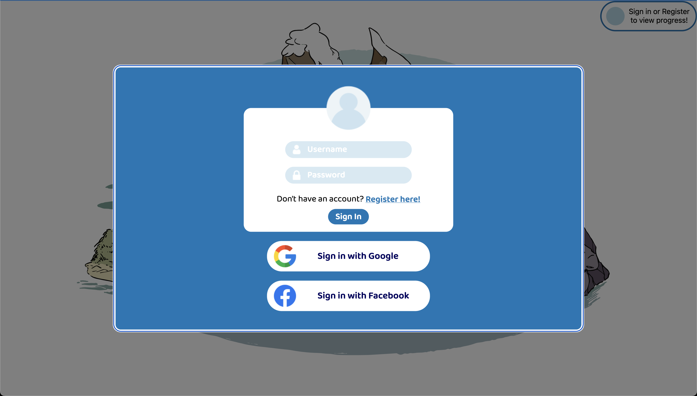
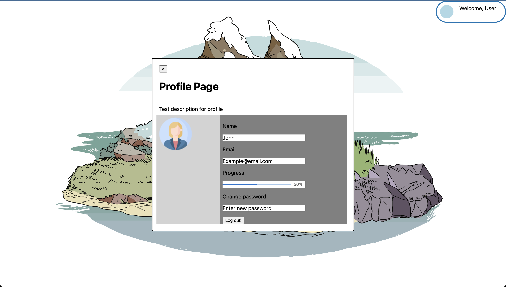
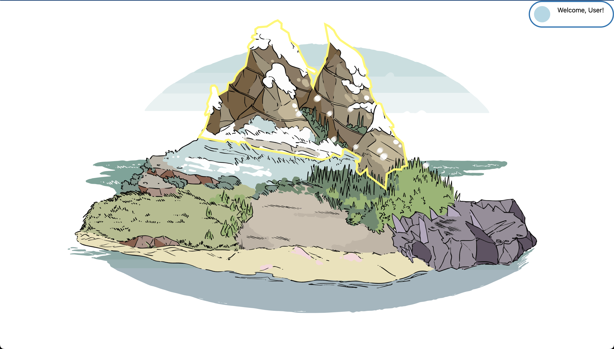
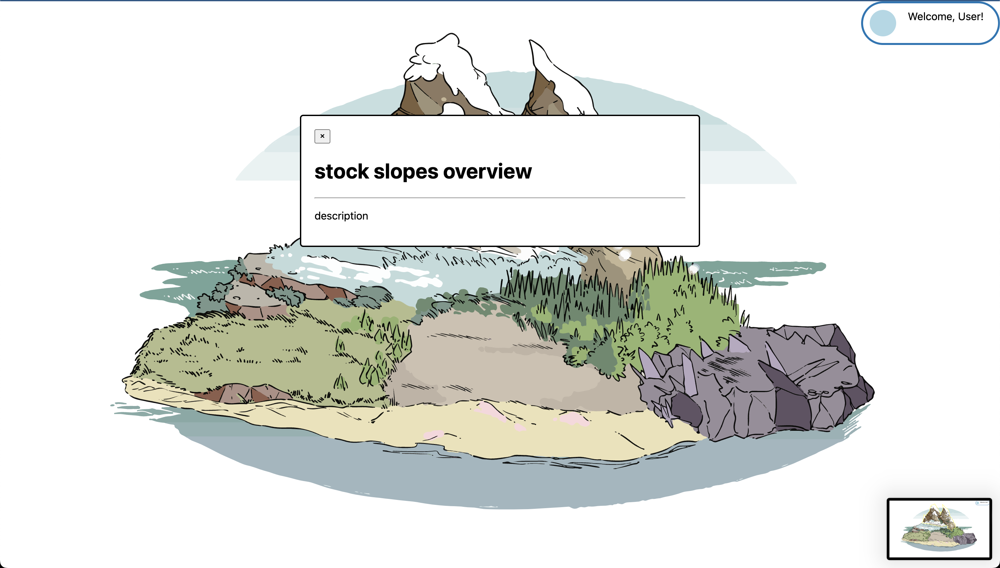

## Welcome to the Investment Island Repo
Investment Island is an online quiz game to help beginner investors learn more about investing in Stock, Bonds, Crypto-currency, Real-Estate and Forex using flashcards and quizzing.
The purpose of building this project is to provide new and begineer developers to gain industry-level experience by going through the software development lifecycle with real-life work practices. 

I was the project manager for this project and with the help of my assistant-manager, we were able to mentor 6 beginner developers and designers, some of who later went on to land internships that summer.

This is a [Next.js](https://nextjs.org/) project bootstrapped with [`create-next-app`](https://github.com/vercel/next.js/tree/canary/packages/create-next-app).

## Idea and Features
Although we were not able to complete the project due to members leaving the team, we got really close to completion. The goal of the project was to provide learning material to users in the form of digital flash cards pn the site. The users would then complete a quiz and tested on the material they learned which would then get scored to show how well they learned. 
Here are some pages and designs we completed before graduating.

### Sign-In Page
- We used Google and Meta Platform API's to make the sign-in and sign-up process easier.


---

### Profile
- Shows basic information about the user, change password feature and also shows user's progress so far.


---

### Island Design and Flash Card
- We worked hard to make an engaging design for the Island. The 5 different areas of the Island are clickable and interactable so can be clicked to open the flash cards and the subsequent quizzes.

 
---

## Getting Started

First, run the development server:

```bash
npm run dev
# or
yarn dev
```

Open [http://localhost:3000](http://localhost:3000) with your browser to see the result.

You can start editing the page by modifying `pages/index.tsx`. The page auto-updates as you edit the file.
